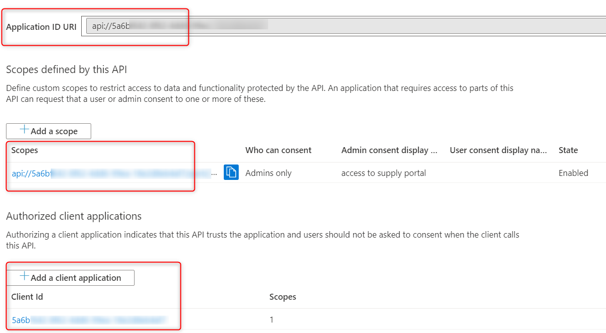
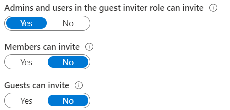

# Overview

This sample application modifies the [react-sample-app](https://github.com/AzureAD/microsoft-authentication-library-for-js/tree/dev/samples/react-sample-app) for [Microsoft Authentication Library (MSAL) for JavaScript](https://github.com/AzureAD/microsoft-authentication-library-for-js). It demonstrates the following scenarios:

1. It calls a [ASP.NET Core Web API](aspnet-core-webapi/Controllers/WeatherForecastController.cs) built with [Microsoft.Identity.Web](https://github.com/AzureAD/microsoft-identity-web) which helps integrating ASP.<span></span>NET Core middleware with [Microsoft Identity Platform](https://docs.microsoft.com/en-us/azure/active-directory/develop/) (formerly _Azure AD v2.0 endpoint_).
2. With a configuration change in the frontend [.env](react-sample-app/.env.sample) and backend [AppSettings.json](aspnet-core-webapi/appsettings.json), this app can authenticate with Azure AD (Single Tenant or B2B) or Azure AD B2C.
3. When used with Azure AD B2B, it calls a [Web API](aspnet-core-webapi/Controllers/UserController.cs) which further calls a Graph API to invite a B2B user, or to check the user's invitation status.
4. There are 3 frontend samples:
    * [react-sample-app](react-sample-app) is a React.js SPA using MSAL v1 which supports OAuth2 Implicit flow.
    * [next-sample-app](next-sample-app) is a Next.js frontend also using MSAL v1 with implicit flow. Note that MSAL references `window` object so this sample [loads MSAL on the client side](next-sample-app/components/auth-utils.js#L39) rather than server side. 
    * [react-pkce-sample-app](react-pkce-sample-app) is a React.js sample using MSAL v2 which support [PKCE](https://oauth.net/2/pkce/). At the time of this writing, I can only make it work with @azure/msal-browser 2.0.0-beta.2 due to [this issue](https://github.com/AzureAD/microsoft-authentication-library-for-js/issues/1846) in 2.0.0-beta.4. Make sure you register your SPA in Azure AD to enable PKCE as documented [here](https://docs.microsoft.com/en-us/azure/active-directory/develop/quickstart-v2-javascript-auth-code). 

## Register and configure an Azure AD Application
Before you can run this app, your must register an application in Azure AD B2C and/or Azure AD. You can register a single application for both frontend UI and backend web service. Refer to the documentation on how to [register an application for Azure AD](https://docs.microsoft.com/en-us/azure/active-directory/develop/quickstart-register-app) or [for Azure AD B2C](https://docs.microsoft.com/en-us/azure/active-directory-b2c/tutorial-register-applications?tabs=app-reg-ga) in general. Customize the app as following for B2B and B2C respectively.

### For B2B:
* Configure the application type - register the app as a single tenant application with **Accounts in this organizational directory only**
* Configure the token - go to **Token configuration**, **Add optional claim**, click **ID**, and add `email` and `upn`. Further edit the `upn` claim to turn on `upn` for guests as shown below:


* Configure exposed API scopes - go to **Expose an API**, **Add a scope** for our `WeatherForecast` API. Since we own both the frontend and the backend, we can add our application as an **Authorized client application** without having to ask the user to consent for the frontend to access the API. 



* Configure required API permissions - go to **API permissions**, and add the following **delegated** permissions from Microsoft Graph API. This is such that the backend web api can access Graph API on-behalf-of the logged in user. Optionally grant admin consent for the permissions.
    * User.Invite.All
    * User.Read
    * User.Read.All

* Optionally assign users to this app so that this app shows up on their `myapps` page - go to **Enterprise applications** of Azure AD, find the application corresponding to the registered application, **Assign users and groups**.
* Optionally allow only assigned users to access this application - go to **properties** of the enterprise applicatio, turn on/off **User assignment required**. 


### For B2C:
* Configure the application type - register the app with **Accounts in any organizational directory or any identity provider. For authenticating users with Azure AD B2C.**
* Configure the token - go to your signup/signin user flow, **Application claims**, and check **Email Addresses**. 
* Configure exposed API scopes - go to **Expose an API**, **Add a scope** for our `WeatherForecast` API. 
* Configure required API permissions - go to **API permissions**, **Add a permission**, **my APIs**, and add the scopes defined above.

### For both B2B and B2C:
* Go to the **Authentication** menu of the app, **Add a platform** to add a **Web** application. Add **Redirect URIs**, and enable **Implicit grant** for **Access tokens** and **ID tokens**. _MSAL.js 2.0 is still in preview as of May 2020. This sample isn't using PKCE yet._
* Go to **Manifest**, and change `"accessTokenAcceptedVersion": null,` to `"accessTokenAcceptedVersion": 2,`. This is so that Azure AD will use the v2 endpoints.

## How to run locally
1. Start the backend web service
    * configure AppSettings.json and replace the parameters with your Azure AD values
    * `dotnet run`, and the app will start at `https://localhost:5001` by default

2. Start the frontend app
    * to run the react.js app
        * if it's the first time you run the app, `npm install`
        * `npm start`, and the app will start at `http://localhost:3000` by default
    * to run the next.js app
        * if it's the first time you run the app, `npm install`
        * `npm run dev`, and the app will start at `http://localhost:3000` by default

3. Follow the UI to: 
    * sign in
    * call Weather API (available for both B2B and B2C)
    * invite a user to B2B (only available when configured for B2B)
    * check a B2B user's invitation status (only available when configured for B2B)

## Privileges required to make the calls
The Web API calls the Graph API _on-behalf-of the user_, rather than using the application's identity. This means:
* To be able to invite a B2B guest user, the signed-in user making the call must have `User.Invite.All` permission in Azure AD. There are several knobs your Azure AD admin can tune for this. Go to your Azure AD portal, **User settings**, **Manage external collaboration**:



* To be able to check a B2B guest user's invitation status, the signed-user must have `User.Read.All` permission in Azure AD. If guests permissions are limited as shown below, then guests won't be able to read other guests' invitation status unless they are assgined the `Directory readers` role.


## Things to note
1. It's ok to invite a guest user multiple times, you won't see any error.
2. If you invite a user whose email ends in the target Azure AD tenant domain name, you will see an error saying that the invitee is in the invitor tenant. For example, the target Azure AD tenant is `contoso.onmicrosofot.com`, and you try to invite `alice@contoso.onmicrosoft.com`.
3. If you invite a user whose email ends in a validated domain name in the target Azure AD, you will see an error saying that this user cannot be invited because the domain of the user's email address is a verified domain of this directory.
4. B2B users with personal accounts are not redirected to the app after they log out. B2B users with work or school accounts or B2C don't have this problem. This is a known issue discussed in many places, incuding this [ADAL issue](https://github.com/AzureAD/azure-activedirectory-library-for-js/issues/811#issue-366332243). It's still an issue in MSAL.
5. After the user logs out, it appears that the user is redirected to either the `postLogoutRedirectUrl` configured in [UserAgentApplication](react-sample-app/src/auth-utils.js#L45) or the start up page if it's not configured. What's configured in AAD app registration as `Logout URL` seems to be ignored. This also happens to B2B. `Logout URL` is honored in B2C when `ID_TOKEN_HINT` is set.
6. You can use `upn (user principal name)` or `object id` to check a user's invitation status. Note that `upn` for a guest user is not their email. Typically, if a guest with email address `alice@guest.com` is invited to `host.com` tenant, then the guest's `upn` is `alice_guest.com#EXT#@host.com`. This can become even more complex after `alice@guest.com` is invited to `host.com`, and now creates another tenant `host2.com`. Now her `upn` will be `alice_guest.com#EXT#_host.com#EXT#@host2.com`. But she can't log in to `host2.com` using either `upn`s until `alice@guest.com` is invited to `host2.com` again.
7. While a B2B guest user always has `email` in the ID token, a user belongs to the tenant often has `email` set to null. This is because `email` is used to invite a guest user, but for native tenant users, its value need to be retrieved from Office 365.
8. Things I learned converting from react.js to next.js:
    * Place the UI pages in the `pages` folder, the REST API calls in the `api` folder, and other components in the `components` folder.
    * If a component uses browser side objects such as `window`, it can't be rendered on server side. With HOC (High Order Component) wrapping around the `App`, I found it also challenging to dynamically import MSAL with [no server side rendering](https://nextjs.org/docs/advanced-features/dynamic-import#with-no-ssr). But simply validating the `window` object [works fine](next-sample-app/components/auth-utils.js#L39).
    * Environment variables are handled differently in react.js vs next.js. By default, in next.js, they are only available on the server side. You can either prefix them with `NEXT_PUBLIC_` or pass them through in `next.config.js` to make them available to the browser. I used the latter so I can have the same environment variable names for react.js and next.js.
    * In next.js, dynamic environment variable name doesn't work. For example, the following doesn't work on the browser side in config.js:
    ```
    const authScheme = process.env.AUTH_SCHEME;
    console.log(process.env["API_SCOPES_" + authScheme])  
    ```
